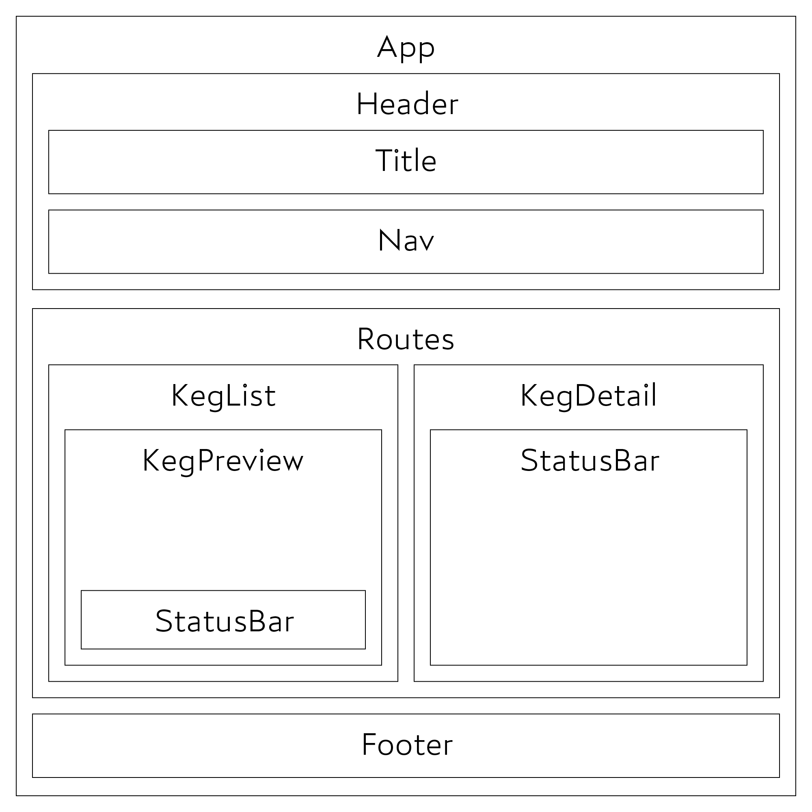

# Tap Room

_by Jeremy Banka_

## Technologies Used

- ✨ JavaScript 🛠 Airbnb ESLint
- ⚛️ React via `create-react-app`
- 🏷 Typechecking with `prop-types`
- 🛣 Paths with `react-router`
- 👨‍🔬 JSX via `hyperscript`
- 👩‍🎤 Styling with `emotion.js`  `SCSS`
- 🎨 Colors and shading with `luum.js`
- 🧑‍🎨 Diagrams with Adobe Illustrator

## Description

This is a React.js demo covering shared state, function components, class components, and CR (but not UD) functionality. No hooks.

But wait!! It also contains a unique implementation of hyperscript, a minimal, functional wrapper around JSX that's quick to write and easy to read. 

Basically, instead of 

```jsx
<Component someProp="foo">
  <p>Some text</p>
  <p>Some text with a {variable}</p>
</Component> 
{/* 95 characters */}
```

You'll see

```js
Component(
  { someProp: `foo` },
  p(`Some text`),
  p(`Some text with a ${variable}`)
) // 89 characters. But trust me, it adds up. 
```

Everything works the same, but there's no heavy stacks of quasi-XML hogging space in your editor--just lean, mean JS functions! The best part is, it's *fewer than fifty lines* to make this work. Read `src/util/hyperscript/lib.js` to see how.

(npm package coming soon...)

## Component Diagram



## Setup/Installation Requirements

#### 1: Download the Materials

- Clone this repo: `$ git clone https://github.com/jeremybanka/tap-room`
- Get your `node_modules` installed: `$ npm i`

#### 2: Build and Run

- Get things compiled and serving: `$ npm run start`
- This should prompt your browser to open the project on :3000.
- You can also `$ npm run build` to peep the built code.

#### Tooling: Getting ESLint Working

- Use VS Code.
- Install VS Code extension "ESLint" by Dirk Baeumer.
- Ensure that your VS Code settings.json has the following property set:
  ```
  "editor.codeActionsOnSave": {
    "source.fixAll.eslint": true
  }
  ```
- Now, my meticulously selected formatting preferences will be applied to files in this repo any time you hit save!

## Known Bugs

- none identified

## License

Gnu Public License ^3.0. All rights reversed.

## Contact Information

hello at jeremybanka dot com
